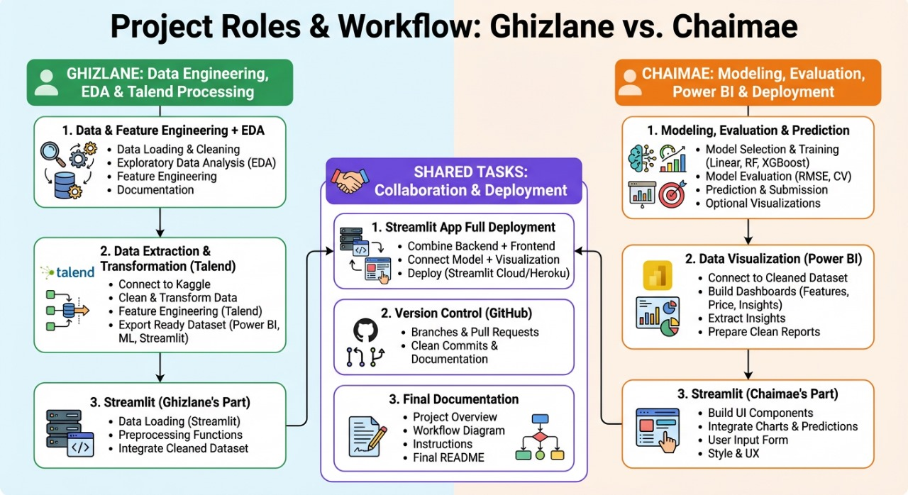

# house-price-prediction-advanced-ml

## 📌 Project Roles & Workflow

Below is the full workflow showing the responsibilities of **Ghizlane** and **Chaimae**:



# 🏡 Ames Housing Price Prediction — End-to-End Data Pipeline (Talend · Power BI · Machine Learning · Streamlit)

This repository contains a **complete real-world Data Science & Data Engineering project** built by **Ghizlane** and **Chaimae**.
It covers the full lifecycle of a predictive analytics solution — from **raw data extraction** to a **deployed interactive web app**.

The project is based on the **Ames Housing dataset**, a modern alternative to the Boston Housing dataset, widely used to practice machine learning and price prediction tasks.

---

## 📌 Project Overview

The goal of this project is to **predict house sale prices** in Ames, Iowa using advanced Machine Learning techniques.

To achieve this, we built a **full end-to-end workflow**:

✔ Extract and transform data with **Talend**
✔ Perform EDA and feature engineering
✔ Train and evaluate ML models
✔ Build insights dashboards with **Power BI**
✔ Deploy an interactive **Streamlit** application for predictions

This project demonstrates real-world skills in **data engineering**, **business intelligence**, **machine learning**, and **application deployment**.

## 👥 Contributors & Responsibilities

### 🌿 **Ghizlane — Data Engineering & ETL**

* Data cleaning and preprocessing
* Exploratory Data Analysis (EDA)
* Feature engineering
* Building ETL workflow in **Talend**
* Preparing clean dataset for BI, ML and Streamlit
* Backend data integration in Streamlit

---

### 🔶 **Chaimae — Machine Learning & BI**

* Model training (Linear Regression, Random Forest, XGBoost, etc.)
* Hyperparameter tuning
* RMSE-based model evaluation
* Prediction generation & submission format
* Power BI dashboard creation
* Streamlit UI & user experience

---

## 🔄 End-to-End Pipeline

### **1. ETL (Talend Open Studio)**

* Download dataset from Kaggle
* Handle missing values & fix data types
* Encode categorical variables
* Apply feature transformations
* Export fully cleaned dataset (CSV)

### **2. Exploratory Data Analysis**

* Distribution plots
* Correlation heatmaps
* Outlier detection
* Feature importance exploration
* Log-transformations & scaling

### **3. Machine Learning Modeling**

Models used:

* Linear Regression
* Random Forest Regressor
* Gradient Boosting (XGBoost / LightGBM / CatBoost)
* Cross-validation
* RMSE on log(SalePrice)

Outputs:

* Best model selection
* Predictions for the Kaggle test set

### **4. Data Visualization (Power BI)**

* Price distribution
* Feature relationships
* Neighborhood analysis
* Quality vs Price insights
* Dashboard storytelling for stakeholders

### **5. Deployment (Streamlit App)**

The web application includes:

* Dataset preview
* Visual insights
* User input form to predict price
* Real-time model inference

---

## 📁 Repository Structure

```
📦 ames-housing-pipeline
 ┣ 📂 data/
 ┣ 📂 talend_etl/
 ┣ 📂 notebooks/
 ┣ 📂 powerbi/
 ┣ 📂 models/
 ┣ 📂 streamlit_app/
 ┣ 📂 assets/images/
 ┗ README.md
```

---

## 📘 About the Ames Housing Dataset

The **Ames Housing dataset** contains **79 explanatory features** describing residential homes in Ames, Iowa (USA).
It is widely used for teaching and benchmarking regression models.

Target variable:
🟦 `SalePrice` — sale price of each house.

This dataset is used in a Kaggle competition focused on **RMSE of log-transformed prices**.

---

## 🚀 Goals of This Project

This project helps us practice and demonstrate:

* Real ETL skills (Talend)
* Professional-level EDA & feature engineering
* Solid ML regression modeling
* Real BI dashboard creation (Power BI)
* App deployment skills (Streamlit)
* Team collaboration + project workflow

Perfect for data science, data engineering, and analytics portfolios.

---

## 🤝 Acknowledgments

Dataset provided by Kaggle: **Ames Housing Competition**.
ETL built with **Talend Open Studio**.
Visuals made with **Power BI**.
Web app created using **Streamlit**.


